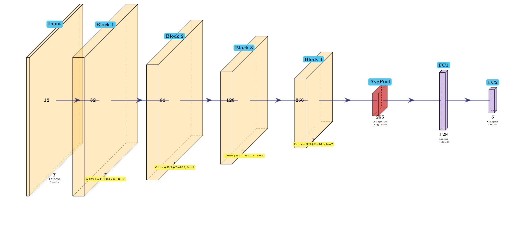
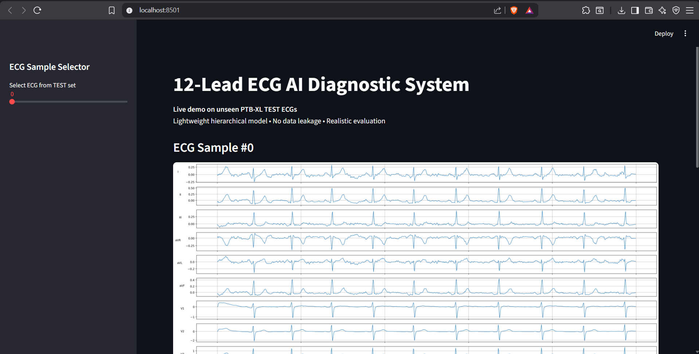

# HMT-ECGNet  
**Lightweight Hierarchical Multi-Lead ECG Classification on PTB-XL**

---

## Overview

**HMT-ECGNet** is a **lightweight, hierarchical deep learning system** for automatic ECG interpretation, designed and evaluated on the **PTB-XL** dataset under **strict, leakage-free conditions**.

The project demonstrates that **carefully designed, parameter-efficient neural architectures** can achieve **competitive diagnostic performance** compared to large CNNs (e.g., ResNet) while remaining **deployable in real-world clinical and edge environments**.

This repository represents an **end-to-end ML system** — from data preprocessing and training to evaluation, inference API, and interactive visualization.

---

## Key Contributions

- **Hierarchical multi-lead ECG modeling** (lead-wise → global aggregation)
- **Sub-million parameter architecture** (~0.34M params)
- **Strict PTB-XL official splits** (no patient leakage)
- **Honest evaluation** (no test-set threshold tuning)
- **End-to-end deployment demo** (FastAPI + Streamlit)
- **Baseline comparison with ResNet**

---

## Problem Statement

ECG classification is typically addressed using:
- very large CNNs (10–60M parameters), or
- Transformer-based architectures with heavy compute requirements.

However, such models:
- are difficult to deploy on **edge / wearable devices**,
- often over-report performance due to **data leakage**,
- ignore **realistic performance ceilings** caused by label ambiguity.

> **Goal:**  
> Can a **lightweight, hierarchical neural network** achieve strong diagnostic performance on PTB-XL when evaluated correctly?

---

## Architecture: HMT-ECGNet

### High-Level Design

``` markdown

├─ 12-Lead ECG (10s)
│
├─ Shared per-lead temporal encoder
│
├─ Lead-wise feature tokens
│
├─ Hierarchical cross-lead aggregation
│
├─ Global temporal pooling
│
└─ Classification head
``` 





### Design Principles

- **Per-lead temporal modeling** with shared weights
- **Hierarchical aggregation** instead of heavy attention
- **Explicit separation of temporal and spatial modeling**
- **Parameter efficiency first**, accuracy second

**Total parameters:** ~**338K**

---

## Training Protocol

- Optimizer: **AdamW**
- Learning rate schedule: **Cosine Annealing**
- Loss:
  - Multi-label: `AsymmetricFocalLoss` with class balancing
  - Binary: `BCEWithLogitsLoss`
- Regularization:
  - Signal preprocessing
  - Early stopping
- Reproducibility:
  - Fixed random seeds
  - Deterministic splits

---

## Results

### Multi-Label Classification (Test Set)

| Metric | HMT-ECGNet |
|------|-----------|
| AUROC (macro) | **≈ 0.92** |
| AUPRC (macro) | ≈ 0.78 |
| F1 (macro) | ≈ **0.73** |
| Parameters | **0.34M** |

---

### Binary Classification — MI vs Normal (Test Set)

| Metric | HMT-ECGNet |
|------|-----------|
| AUROC | **≈ 0.98** |
| Accuracy | ≈ 0.92–0.93 |
| F1 | ≈ **0.89** |

**Observation:**  
Accuracy saturates due to ambiguous ECGs, while AUROC remains high — indicating strong class separability under realistic conditions.

---

## Baseline Comparison

| Model | Params | AUROC (Multi) | F1 (Multi) |
|------|--------|--------------|------------|
| **ResNet-1D** | ~8.7M | ≈ 0.90 | ≈ 0.70 |
| **HMT-ECGNet (ours)** | **0.34M** | **≈ 0.92** | **≈ 0.73** |

**HMT-ECGNet outperforms ResNet while using ~25× fewer parameters**

---

## Deployment Demo

Due to dataset licensing and size constraints, this project is not deployed as a public live demo.

However, the **full inference and visualization pipeline is implemented and reproducible locally**.

To launch the interactive ECG visualization and AI diagnosis interface:

```bash
streamlit run app.py
```

This repository includes a **production-style demo**:

- **FastAPI** inference server
- **Streamlit** UI
  - Live ECG visualization
  - Real-time predictions
  - MI risk screening
- Uses **unseen PTB-XL test ECGs**


[](https://github.com/MahboobAlam0/hmt_ecg_healthmonitoringsystem/issues/1#issue-3938528989)


---


## Dataset

### PTB-XL (PhysioNet, 2020)

- ~21,800 ECG recordings  
- 12 leads  
- 10 seconds per ECG  
- Original sampling: 500 Hz (downsampled during preprocessing)
- Official **patient-level splits**:
  - Train: folds 1–8
  - Validation: fold 9
  - Test: fold 10

### Tasks

- **Multi-label classification (5 diagnostic superclasses)**
  - NORM, MI, STTC, CD, HYP
- **Binary classification**
  - MI vs Normal
  - Normal vs Abnormal

⚠️ **Important:**  
All experiments strictly follow official PTB-XL splits.  
There is **no patient leakage**, **no test-set tuning**, and **no post-hoc threshold optimization**.

---

## Error Analysis & Insights

- Ensemble models improve **stability**, not accuracy
- Remaining errors are **systematic**, not variance-driven
- Confirms a **performance ceiling** on PTB-XL due to:
  - label ambiguity,
  - inter-observer disagreement,
  - borderline ECG patterns

---


## Project Structure

```markdown
├── hmt_ecgnet/
├── artifacts/
│   ├── mi_best.pth
│   ├── multilabel_best.pth
│   ├── multilabel_thresholds.json
│   └── resnet_baseline.pth
│
├── .gitignore
├── models/
│   ├── hmt_ecgnet.py
│   └── resnet1d.py
│
├── api.py
├── app.py
├── dataset.py
├── train_multilabel.py
├── train_binary.py
├── eval_multilabel.py
├── eval_binary.py
├── threshold_search.py
├── threshold_search_multilabel.py
├── config.py
└── README.md
```   

---

## References

1. Wagner et al.  
   **PTB-XL: A Large Publicly Available Electrocardiography Dataset**  
   *PhysioNet, 2020*

2. Ribeiro et al.  
   **Automatic diagnosis of the 12-lead ECG using deep neural networks**  
   *Nature Communications, 2020*

3. Hannun et al.  
   **Cardiologist-Level Arrhythmia Detection with Deep Neural Networks**  
   *Nature Medicine, 2019*

4. Rajpurkar et al.  
   **Cardiologist-Level Arrhythmia Detection Using Deep Neural Networks**  
   *arXiv:1707.01836*

5. Tan & Le  
   **EfficientNet: Rethinking Model Scaling for CNNs**  
   *ICML, 2019*

---

## Disclaimer

This system is **for research and demonstration purposes only**  
and **not intended for clinical diagnosis or treatment**.

---

## Author Note

This project emphasizes:
- **engineering discipline**
- **honest evaluation**
- **deployment realism**
- and **model efficiency**

rather than leaderboard chasing.